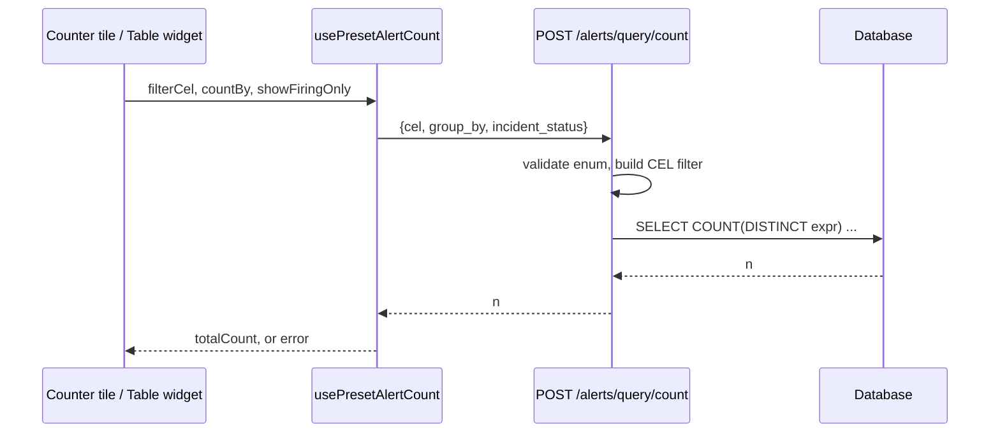

# Count-by for the Alert Count Panel and Alert Table widget

Mock (open in a browser): [`2026-10-08-alert-count-group-by-mock.html`](2026-10-08-alert-count-group-by-mock.html)

Touches two repos: `keep-api-gateway` (this spec's home) and `keep-ui`. No change to `keep-event-handler`, `keep-workflows` or `keep-migrations`.

## Intro

### The problem

A dashboard count tile can only count **alerts**. A team that wants to watch "how many incidents are live right now" gets a number inflated by alert fan-out: one incident with 40 firing alerts adds 40 to the tile, so the tile says "critical" when there is one problem. The gateway endpoint behind the tile, `POST /alerts/query/count`, only ever counts alerts, and even when a query filters on incident fields it counts distinct alerts, never incidents.

Users need a tile (and the count line of the Alert Table widget) that can instead show the number of **distinct values of a chosen field** among the alerts a preset matches. The headline case is distinct incidents; the same mechanism gives distinct services, hosts, alert names and so on.

### Why we got this assignment

This came out of a design discussion on dashboard widgets: the main user story is displaying the count of live incidents instead of firing alerts. No customer escalation or deadline was stated. If there is one, add it here.

## Requirements

### Functional requirements

**Widget configuration (keep-ui)**

1. Both preset panel types (Alert Table and Alert Count Panel) show a **Count** segmented control in the widget form: `Alerts` (default) | `Incidents` | `Other field`.
2. Choosing `Incidents` shows an **Incident status** select: `Active (firing + acknowledged)` (default), `Firing only`, `Acknowledged only`.
3. Choosing `Other field` shows a **Field** select with exactly: Alert name, Service, Host, Application, Site, Assignee (API values `name`, `service`, `node_name`, `application`, `site`, `assignee`).
4. Helper copy under `Incidents`: "Distinct incidents with at least one alert matching the preset." Under `Other field`: "Counts distinct values of that field. Empty values aren't counted."
5. The choice is saved in the widget JSON as `countBy: { field, incidentStatus? }`. A widget without `countBy` counts alerts exactly as today; no dashboard needs migrating.
6. Editing a preset widget into another widget type removes `countBy` (the type-switch field stripping covers it).

**Counting (keep-api-gateway)**

7. `POST /alerts/query/count` accepts two optional body fields, `group_by` and `incident_status`, and still returns a bare integer.
8. `group_by` is a closed enum: `incident`, `name`, `service`, `node_name`, `application`, `site`, `assignee`. Any other value is rejected with a 422.
9. `incident_status` is `active` | `firing` | `acknowledged`, defaults to `active`, and is only valid with `group_by=incident`; otherwise 422.
10. With `group_by=incident` the result is the number of distinct incidents that (a) have status in the selected set and (b) are linked, through a link that is not soft-deleted, to at least one alert matching the request's CEL. Alerts with no such incident contribute nothing. An alert linked to two qualifying incidents contributes to both.
11. With any other `group_by` the result is the number of distinct non-null values of that field among the alerts matching the CEL.
12. The request CEL is built by the UI exactly as today (preset CEL, dashboard time range, and `status == 'firing'` when "Show Firing Alerts Only" is on), so those filters restrict the matching alerts before distinct-counting.
13. Without `group_by` the endpoint behaves exactly as today, including its current error handling.

**Rendering (keep-ui)**

14. Counter tile: title row unchanged; below the number a caption `● <label>` where the dot takes the threshold colour. Labels: `Active|Firing|Acknowledged incidents`, `Alert names`, `Services`, `Hosts`, `Applications`, `Sites`, `Assignees`; singular when the count is 1. Alert-counting tiles get no caption.
15. Thresholds, tile colour and click-through-to-preset use the grouped number.
16. Alert Table widget: when `countBy` is set, a line `● <label>: <n>` appears above "Alerts count", coloured by thresholds; the table tint follows the grouped number; the alerts-count line turns neutral grey; table rows are unchanged (latest N alerts). When `countBy` is not set the header is unchanged.
17. Loading shows the number skeleton with the caption already present. Zero shows `0`. A failed grouped request shows a neutral grey tile with `—` and the caption "Couldn't load count"; it never shows `0`.

### Non-functional requirements

- **Backward compatibility.** Both new fields are optional; ungrouped requests, ungrouped widgets and the sidebar preset counters are unchanged. An *old* gateway silently ignores `group_by` and returns the alert count, so the gateway must be deployed before keep-ui.
- **Performance.** One `COUNT(DISTINCT …)` per grouped widget per 30 s refresh, over the same bounded alert window plain counts use (`ALERTS_HARD_LIMIT`). Ungrouped widgets add zero requests; a grouped Alert Table widget adds one. No new indexes are expected; this is unmeasured, see "Verify before implementation".
- **Security.** `group_by` is a closed server-side enum mapped to server-owned SQL expressions; no client-supplied identifier reaches SQL. Auth stays `read:alert`; tenant scoping comes from the existing query builder.
- **Observability.** The existing request log lines gain `group_by` and `incident_status` in `extra`.
- **Schema.** No migrations. Widget config lives in the opaque `dashboard_config` JSON; the query is a read-only `SELECT` over existing tables.
- **DB portability.** `COUNT(DISTINCT …)` must work on PostgreSQL, MySQL and SQLite (the test engine).

## Proposed Implementation

### 1. Where the distinct count is computed and exposed



**Option A: Extend `/alerts/query/count`.** New `CountQueryDto(QueryDto)` with `group_by` and `incident_status`, so `/alerts/query` does not accept them; response stays a bare integer.
- Pros: backward compatible; single source of truth for counts; the UI hook only passes two more params.
- Cons: the bare-integer response cannot signal "gateway ignored `group_by`" (hence the deploy-order rule).
- Complexity: low.

**Option B: New `/alerts/query/count-groups` endpoint** returning `{count, group_by}`.
- Pros: leaves the old contract untouched; room for a future per-group breakdown.
- Cons: breakdown is out of scope, so this is speculative duplication of the count builder.
- Complexity: medium.

**Option C: Count client-side** from up to 10,000 fetched alerts.
- Cons: large payload per widget every 30 s; hard cap silently undercounts; incident enrichment cost on every poll.
- Complexity: low, but wrong.

**Recommendation: A.** Smallest change that fully serves the requirement; the deploy-order rule is cheap to follow.

### 2. Which fields are groupable

| API value | UI label | SQL source | Why it is in |
|---|---|---|---|
| `incident` | Incidents | `incident.id` | the headline use case |
| `name` | Alert name | `alert.name` | distinct alert rules matching |
| `service` | Service | `alert.service` | blast radius |
| `node_name` | Host | `alert.node_name` | infrastructure dimension |
| `application` | Application | `alert.application` | infrastructure dimension |
| `site` | Site | `alert.site` | infrastructure dimension |
| `assignee` | Assignee | `lastalert.assignee` | workload view |

Excluded on purpose: `severity`, `status`, `environment` (a handful of values, so a distinct count is meaningless), `source` (a list, so an alert can have several), and all `labels.*` / free-form JSON fields (unbounded cost, unindexed).

**Option A: Incident only.** Smallest; the allowlist mechanism exists but holds one entry.
**Option B: Entity-like typed columns (table above).** Same mechanism, six more one-line entries; each is a meaningful "how many distinct X" tile.
**Option C: Any CEL-mappable field.** Includes enum fields that produce meaningless numbers, and JSON fields with unbounded cost.

**Recommendation: B.** Chosen in the design discussion; adding a field later is one enum entry plus one UI label. Expressions come from the existing CEL-to-SQL field mapping (`get_field_expression`), so column mapping stays in one place.

### 3. What "live incident" means and how the join is built

The shared alert-query join (`__build_query_for_filtering`) is not safe to reuse for distinct incident counting. Read at `origin/dev`:
- it outer-joins `Incident` on `fingerprint IN (fingerprints having some firing incident)` rather than on the joined incident's own status, so an alert linked to both a resolved and a firing incident attaches both;
- it does not exclude soft-deleted `LastAlertToIncident` links, while the rest of the gateway filters them with `deleted_at == NULL_FOR_DELETED_AT`.

For the alert list that is harmless (rows are de-duplicated per alert); for `COUNT(DISTINCT incident.id)` it would over-count.

**Option A: Reuse the shared join, firing only.** Zero new join code; acknowledged incidents vanish from the number when acked; inherits both defects above.
**Option B: Add a status parameter to the shared join.** Still inherits the defects, and risks changing the alert list.
**Option C: Dedicated join when `group_by=incident`, selected by an optional `incident_statuses` argument on `__build_query_for_filtering`.**

```sql
FROM lastalert
JOIN alert ON alert.id = lastalert.alert_id AND alert.tenant_id = lastalert.tenant_id
JOIN lastalerttoincident lai
  ON lai.tenant_id = lastalert.tenant_id
 AND lai.fingerprint = lastalert.fingerprint
 AND lai.deleted_at = :NULL_FOR_DELETED_AT
JOIN incident
  ON incident.tenant_id = lai.tenant_id
 AND incident.id = lai.incident_id
 AND incident.status IN (:statuses)
WHERE lastalert.tenant_id = :tenant
  AND lastalert.timestamp >= :threshold
  AND (<request CEL>)
```

`active` = `IncidentStatus.get_active()` (firing + acknowledged); `firing` and `acknowledged` are single-element sets. With `incident_statuses=None` (every existing caller) the builder is unchanged byte for byte. Preset CEL that references `incident.*` fields while grouped by incident sees the same filtered join, so filter and count agree. For any other `group_by` the existing join is used as is.

**Recommendation: C.** Correct by construction and invisible to existing callers. The two shared-join defects are logged as a follow-up, not fixed here.

### 4. Widget configuration and persistence

Only one approach is viable: store `countBy` inside the widget object in `dashboard_config` (opaque JSON, no gateway validation of its contents). A dedicated DB column or table would force a migration to carry two enum values that already round-trip through JSON. `WidgetData` gets `countBy?: { field: CountByField; incidentStatus?: IncidentStatusFilter }`; `widget-type-fields.ts` lists `countBy` among the preset-owned keys; a constants module holds the field list, UI labels and unit labels, mirroring the gateway enum.

**Recommendation:** inline JSON, as above.

### 5. Form control

**Option A: One "Count by" dropdown** listing Alerts, Incidents and the six fields. Existing `Select`; easy to extend; Incidents is just the second entry.
**Option B: Segmented `Alerts | Incidents | Other field`** with a second dropdown behind "Other field". The headline case is one click; the other six fields cost one extra step; adds a control type (Tremor's solid `TabList` if it fits, else a small custom component).

**Recommendation: B**, chosen after reviewing the mock: it makes the primary story one click.

### 6. Counter tile label

A bordered chip between title and number was tried and rejected (it competed with both).

**Option A: Side label** ("3 active incidents"). Best at small sizes; wraps on long labels.
**Option B: Dot caption** under the number, dot in the threshold colour. Quietest; three stacked rows at compact size.
**Option C: Footer band** in a tinted strip. Most "stat tile"; truncates when narrow.

**Recommendation: B**, chosen after reviewing the mock.

### 7. Alert Table widget behaviour

**Option A: Separate group-count line; rows stay alerts.** Honest labels, smallest change.
**Option B: Rows become one per group.** Makes "showing 5 of 12 incidents" literally true but needs a new server-side distinct-row query.
**Option C: Counter tile only.** Narrower than the request.

**Recommendation: A.** Thresholds and tint follow the grouped number; the alerts-count line goes neutral so one number carries colour.

### 8. Failure behaviour

Today `query_total_alerts_count` catches `OperationalError` and returns `0`, and the UI hook turns any failure into `0`. For a "live incidents" tile, a silent `0` reads as "all clear".

**Option A: Keep returning 0.** No change; wrong for this use case.
**Option B: Grouped requests fail loudly.** The grouped path does not catch `OperationalError` (the client sees a 5xx); the hook exposes an error flag and returns no number; the tile shows `—` / "Couldn't load count". Ungrouped behaviour is untouched.

**Recommendation: B**, scoped to the grouped path so nothing existing changes.

### 9. Testing and rollout

Gateway (pytest, run with `PYTHONPATH=.` from the worktree; conftest only patches the db / db_utils / alerts engines):
- 40 alerts in one incident count as 1; an alert in two qualifying incidents counts both.
- Each status mode, including a fingerprint linked to one resolved and one firing incident (firing mode counts only the firing one).
- A soft-deleted link is excluded.
- Non-incident fields: NULLs not counted; per-field correctness.
- Validation: unknown `group_by` and `incident_status` without `group_by=incident` both 422.
- Ungrouped count is unchanged; a CEL error is still a 400; a DB `OperationalError` on the grouped path surfaces as an error, not `0`.

keep-ui (Jest): form state to `countBy` and back; `getCountUnitLabel` incl. singular; hook request payload and SWR key; tile caption, loading, zero and error states; table widget extra line and neutral alerts line; `stripForeignTypeFields` drops `countBy`.

Rollout: branches from `origin/dev` (local `dev` is stale in both repos); merge and deploy the **gateway PR first**, then keep-ui. Nothing is pushed until asked.

## Summary

- **Chosen approach:** extend `POST /alerts/query/count` with an allowlisted `group_by` and an `incident_status`, computed as `COUNT(DISTINCT …)` in the gateway; add a "Count" segmented control to the preset widget form; render the grouped number with a dot caption on the counter tile and a separate count line on the Alert Table widget. No migrations.
- **Key decisions:**
  1. Output is one number (distinct groups), not a breakdown, so thresholds, colour and click-through keep working.
  2. Fixed allowlist of entity-like fields; enum-like and multi-valued fields are excluded because a distinct count of them is meaningless.
  3. "Live incident" is selectable (Active default); the grouped path gets its own correct join instead of reusing the shared one.
  4. Table widget keeps alert rows and adds a separate labelled group-count line.
  5. Grouped failures show `—`, never `0`.
- **Out of scope / follow-ups:**
  - Per-group breakdown display and a `count-groups` endpoint (no use case yet).
  - "Resolved incidents" (the dashboard time range filters on alert `lastReceived`, not incident resolution time).
  - `labels.*`, `source`, `severity`, `status`, `environment` as group-by fields.
  - Fixing the shared alert-query incident join (resolved incidents attached via the firing-fingerprint condition; soft-deleted links not excluded). Separate bug, separate PR.
  - Adding a status-aware join or a `deleted_at` filter to the ungrouped `incident.*` CEL path.
- **Verify before implementation:**
  1. `get_field_expression` returns the expected SQL for each allowlisted field on PostgreSQL, MySQL and SQLite.
  2. Tremor's installed version provides a solid `TabList` usable as a segmented control.
  3. The two shared-join defects are real: pin them with a failing test before relying on them.
  4. `EXPLAIN` the grouped query on a large tenant; any needed index would be a `keep-migrations` PR.
  5. `COUNT(DISTINCT incident.id)` behaves on MySQL's UUID column type.
