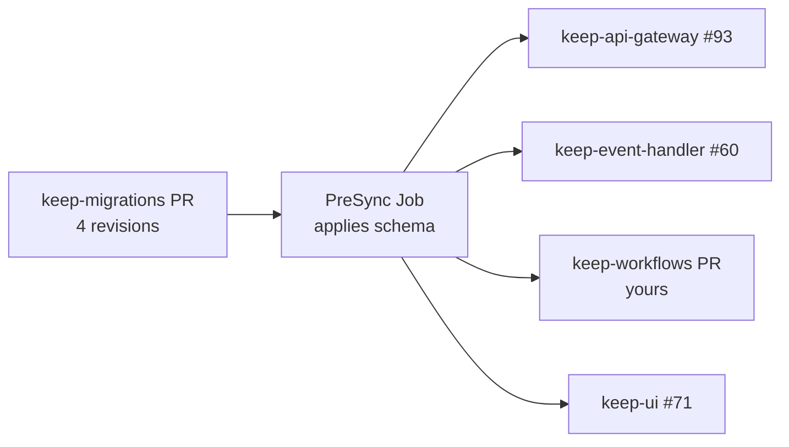

# keep-workflows: close the incident-suppression gap

2026-09-22 · @Someone

keep-workflows needs its own PR alongside keep-api-gateway#93, keep-event-handler#60 and keep-ui#71. It holds its own copies of the dismiss and suppression logic those three rewrite, running against the same database. Four gaps — two fail silently, one re-creates the exact bug the feature exists to remove, and none of them are caught by any test.

Found during review of the other three PRs on 2026-09-22. Every line reference below is verified against `origin/dev` at `716feee`.

## Why this reaches keep-workflows

keep-workflows is not a consumer of a gateway API here — it reads and writes the same `lastalert` and `incident` tables directly, through its own copies of the domain code. The three PRs change four things at once, and keep-workflows holds a stale copy of each:

- how a dismissal is **written** (`normalize_enrichments`)
- how alert suppression is **read** in CEL (`dismissed` field mapping)
- how incident status is **resolved** in CEL (`incident_field_configurations`)
- what **deleting** an incident means (soft flag vs. real `DELETE`)

The gateway and event-handler PRs update their copies. keep-workflows was not touched, so after they merge the two halves of the system disagree about which alerts are suppressed and which incidents exist.

This is the drift risk `CLAUDE.md` calls out directly: the services share domain code *by convention*, as separate copies in separate repos, so a change in one is never automatically reflected in the others.

## The four gaps

Ordered by blast radius. Gaps 1 and 2 fail silently — no exception, no log line.

| # | Gap | Where (`origin/dev` @ `716feee`) | What breaks after the other three merge | Severity | Status |
| --- | --- | --- | --- | --- | --- |
| 1 | Dismiss still writes `status='suppressed'` | `src/common/core/db.py:1362, 1380, 1389` | keep-workflows becomes the **only remaining writer** of that value. The gateway's `derive_alert_suppression` migration clears the historical rows once; workflows immediately starts making new ones. Each is an alert pinned to `suppressed` forever past its deadline — the exact bug the feature exists to fix. | High | Not started |
| 2 | `dismissed` derived from the status column | `src/common/core/alerts.py:188` | Once the status stops being written and the migration nulls existing values, `dismissed == true` matches **nothing**. Workflow triggers filtering on it stop firing; `dismissed == false` starts matching everything. Silent. | High | Not started |
| 3 | Incident status still reads the enrichment JSONB first | `src/common/core/incidents.py:65` | No suppression derivation, and the JSONB still outranks `incident.status`. A dismissed incident reads as `firing`, so automations keep running on incidents a user has explicitly dismissed. | High | Not started |
| 4 | Soft delete + `DELETED` enum member | `src/common/core/db.py:4528` (also `:2733`, `:3953`); `src/common/models/db/incident.py:61` | `IncidentStatus('deleted')` now raises `ValueError` in the gateway. Any incident deleted through workflows becomes a row the gateway's `IncidentDto` cannot parse — a 500 on incident reads. | Medium-high | Not started |

One piece of good news: workflows **already has** the `dismiss_mode` and `dismissed_until` columns on `LastAlert` (`src/common/models/db/alert.py:58-59`, already marked `enrichable: True`). The data model is in place — only the read and write logic is stale.

## What to change

Every change already exists, written and reviewed, in keep-api-gateway#93 — this is mostly a port. The gateway file to copy from is named for each item.

**Groundwork — do this first, the rest depends on it**

1. Add `DismissMode`, `is_dismiss_active()` and `suppressed_if_dismiss_active_sql()` to `src/common/models/db/helpers.py`. Copy from the gateway's `src/models/db/helpers.py`. Keep them byte-identical: both services write these columns in the same database, so any divergence means the two disagree about which alerts are suppressed.
2. Add `is_dismiss_active()` and `get_effective_status()` to `LastAlert` in `src/common/models/db/alert.py`. Neither exists in workflows today. The columns already do.
3. Add `dismiss_mode` and `dismissed_until` to `Incident` in `src/common/models/db/incident.py`. **These are missing in workflows** — `LastAlert` has them, `Incident` does not. No migration here: the columns are created by the gateway's lineage in `keep-migrations`.

**Gap 1 — stop writing the status**

4. In `src/common/core/db.py`, delete the three `result.setdefault("status", "suppressed")` calls at lines 1362, 1380 and 1389, and stop forcing `status = None` on undismiss. Clearing the dismissal is what un-suppresses an alert now. The gateway's `normalize_enrichments` is the reference, including its collapsed `elif "dismiss_mode" in normalized` branch.

**Gap 2 — two sites in the same file, not one**

5. `src/common/core/alerts.py:188` — replace the `dismissed` mapping's `CASE WHEN lastalert.status = 'suppressed'` with the dismiss-column predicate.
6. `src/common/core/alerts.py:142` — the alert `status` mapping is `["lastalert.status", "alert.status"]` and needs the suppressed CASE at the head of that COALESCE chain. **Easy to miss**, and without it workflows never sees an alert as suppressed at all.

**Gap 3 — incident status**

7. `src/common/core/incidents.py:65` — change `map_to` from `["JSON(incidentenrichment.enrichments).*", "incident.status"]` to `[<suppressed CASE>, "incident.status"]`. Dropping the JSONB source is deliberate: it currently outranks the real column, which lets any `status` key written through the enrich route silently shadow an incident's actual status.

**Gap 4 — delete semantics**

8. `src/common/models/db/incident.py:61` — remove `DELETED`, add `SUPPRESSED`, and drop `DELETED` from `get_closed()`.
9. `src/common/core/db.py:4528` — make `delete_incident_by_id` a real `DELETE`, matching the gateway's version, which also clears alert links, the enrichment row, the audit trail and comment mentions. Note the gateway deletes every dependent **explicitly** rather than relying on `ON DELETE`, because SQLite ships `PRAGMA foreign_keys` OFF.
10. `src/common/core/db.py:2733` and `:3953` — remove the remaining `IncidentStatus.DELETED` references.

Worth checking while you are in there: whether workflows has an equivalent of the gateway's `_last_alert_to_dto_payload`, which now derives status rather than copying the column. I could not find one by that name.

## Merge sequencing

This cannot be follow-up work, because the failure mode is silent. Merging and deploying the other three without keep-workflows does not throw — it quietly re-poisons the data the migration just cleaned (gap 1) and switches off a predicate that workflow triggers depend on (gap 2). Gap 4 bites immediately: the first incident anyone deletes through workflows becomes a row the gateway cannot read.

There is time. All three PRs are blocked on their own defects right now — keep-api-gateway#93 has three crash-level bugs (two of them `NameError`s that CI cannot see) and keep-event-handler#60 raises `AttributeError` on every incident delete.

One ordering constraint sits upstream of all of it. The gateway PR puts its four Alembic revisions in `keep-api-gateway`, which stopped owning migrations in `19d8687`. They have to move to `keep-migrations` and chain off `merge_automations_preset_tag`, the real head — not `create_automation_tables`, which that merge revision already absorbed. The schema therefore arrives via the PreSync Job, before any service rolls:

The four service PRs then go together. Same lockstep shape as the CEL enum-case set (`gw#90` / `eh#58` / `wf#37`).

## How to verify, and what I could not check

**Worth testing specifically** — the derived-not-stored design means the interesting case is expiry, which no stored value can represent:

- Dismiss an alert through the workflows write path, then assert `lastalert.status` is still `NULL` and only `dismiss_mode` / `dismissed_until` were written. That is gap 1 closed.
- With an alert dismissed via `dismiss_mode` alone, a trigger filtering `dismissed == true` should match it. Today it will not.
- Set `dismissed_until` in the past and confirm the alert and the incident both revert with **no write** to either row. That is the whole point of deriving rather than storing, and it is where a ported-but-subtly-wrong predicate will show up.
- Dismiss an incident through the gateway, then confirm a workflow incident trigger filtering `status == 'firing'` no longer matches it.
- Delete an incident through workflows, then read it back from the gateway — it should 404, not 500.

**Two traps in this repo**, both of which have bitten before: run the suite with `PYTHONPATH=.` (keep-workflows has no `tests/__init__.py`, so a worktree will silently import `src/` from the main checkout), and never run bare `black src/` or `isort src/` — it reformats \~174 unrelated files. Lint only your changed paths.

**A judgement call for you while porting gap 2.** The existing `dismissed` mapping pairs a `CASE ... 'true'/'false'` text expression with `data_type=DataType.BOOLEAN`. That text-vs-boolean mismatch is a known problem on Postgres and it exists in both repos today; keep-api-gateway#93 carries it forward unchanged rather than fixing it. Your call whether to fix it here or leave the two copies consistent.

**Limits of this review, stated plainly.** I read keep-workflows statically against `origin/dev` at `716feee` and verified every line reference, but I did not run its test suite and there was no keep-workflows PR to review — this gap was inferred from reviewing the other three. I did not exercise any of it against a live Postgres; the gateway's own suite cannot even collect at the moment. Two things I would want answered before you finalise scope:

- Does workflows have an equivalent of the gateway's `_last_alert_to_dto_payload`? I could not find one under that name, and it now derives status rather than copying the column.
- Do any saved presets or workflows in production filter on an incident enrichment `status` key? Dropping the JSONB source (gap 3) is a real behaviour change for those, and the gateway's migration strips the stored copies.
